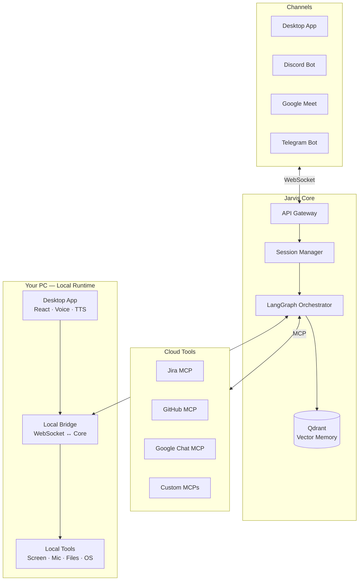

# Jarvis

> An always-on, voice-first AI assistant that bridges your tools, understands your context, and acts on your behalf — locally, privately, and across every platform you work on.

---

## Table of Contents

- [Vision](#vision)
- [The Problem](#the-problem)
- [What Jarvis Does](#what-jarvis-does)
- [Architecture Overview](#architecture-overview)
  - [The Four Zones](#the-four-zones)
  - [The Local Bridge Pattern](#the-local-bridge-pattern)
  - [Session Model](#session-model)
  - [Transport Layer](#transport-layer)
- [Glossary](#glossary)
- [Audio Pipeline](#audio-pipeline)
  - [Client-Side Intelligence](#client-side-intelligence)
  - [Message Levels](#message-levels)
  - [Platform Support](#platform-support)
- [Agent Orchestration](#agent-orchestration)
  - [LangGraph State Machine](#langgraph-state-machine)
  - [Tool System](#tool-system)
  - [Memory & Context](#memory--context)
- [Data Model](#data-model)
- [Monorepo Structure](#monorepo-structure)
- [Tech Stack](#tech-stack)
- [Channels & Clients](#channels--clients)
- [Roadmap](#roadmap)
- [Development Philosophy](#development-philosophy)

---

## Vision

Jarvis is a personal AI operating layer. It lives on your machine, listens to your environment, understands your tools and workflows, and acts as an intelligent copilot across everything you do — from a corporate standup to a late-night coding session.

The name is intentional. The goal is not a chatbot you open a tab for. It is an ambient system that is always present, always listening when you need it, and capable of taking real action in the real world: creating tickets, writing code, opening pull requests, searching your codebase, and doing so across the tools your team already uses.

Unlike cloud-first AI assistants, Jarvis is built with a **local-first, provider-agnostic** philosophy. The STT model, the wake word engine, the vector memory — none of these are locked to a single vendor. The system is designed to run fully offline for the core loop, with optional cloud escalation for heavier tasks.

---

## The Problem

Modern knowledge workers use a fragmented set of tools that barely communicate with each other. A conversation in Google Chat generates work that lives as a Jira ticket, which maps to a GitHub branch, which ties back to a PR that nobody linked to the original discussion. Context is constantly lost in the gaps between tools.

Existing AI assistants address this partially — they can search, summarize, or draft. But they require you to context-switch to them. You have to open a tab, type a prompt, copy the result, go back to your tool. The friction is real, and it accumulates.

Jarvis inverts this. Instead of you going to the AI, the AI is already present in every context you work in. You speak naturally, in the middle of a meeting or a pair-programming session, and Jarvis understands, acts, and reports back — without breaking your flow.

---

## What Jarvis Does

### In a meeting

You are in a Google Meet call. A colleague describes a bug. You say:

> _"Jarvis, did you get that? Create a Jira ticket for the bug he described. Project is X, use our standard template."_

Jarvis transcribes the conversation context, drafts the ticket using your team's conventions from its memory, creates it via the Jira MCP integration, and confirms via voice:

> _"Done. Ticket JX-412 created. Want me to spin up an agent to fix it?"_

### In a coding session

You say yes. Jarvis dispatches a coding agent to your local machine via the Local Bridge, which runs OpenCode against your repository, finds the relevant code, applies the fix, and opens a pull request on GitHub. When the PR is ready, Jarvis receives the webhook and tells you:

> _"PR is up. Want me to open it in the browser?"_

### In the background

Jarvis is always listening, even when you have not invoked it. Ambient conversation is captured, classified as `BACKGROUND` level, and continuously embedded into your vector memory. Over time, Jarvis builds a deep understanding of your projects, your team's patterns, your decisions, and your preferences — without you having to explicitly teach it anything.

---

## Architecture Overview

### The Four Zones

The system is divided into four clearly separated zones, each with a single responsibility boundary.



**Channels** are the interfaces through which users interact with Jarvis. They are responsible for input capture, rendering output, and exposing platform-specific capabilities. They have no business logic.

**Jarvis Core** is the brain. It runs on a server (local or cloud) and handles session management, agent orchestration via LangGraph, memory, and integration with external tools via MCP. It is completely channel-agnostic — it does not know whether it is talking to a Discord bot or the Desktop app.

**Cloud Tools** are external services connected via the Model Context Protocol (MCP). Jira, GitHub, Google Chat, and any future integration live here as discrete tool servers.

**Local Runtime** is the bridge between the cloud-capable Core and the user's physical machine. It gives the Core the ability to take screenshots, control the keyboard, read files, and run commands — capabilities that fundamentally require local hardware access.

---

### The Local Bridge Pattern

This is the most important architectural decision in the system. The Core backend may run anywhere — on the user's machine, on a VPS, or on a managed cloud provider. But certain capabilities are inherently local: taking a screenshot, accessing the microphone, controlling the mouse, reading a local file.

Rather than building two separate systems, Jarvis uses the **Local Bridge pattern**, which is the same model used by GitHub Actions self-hosted runners, the Claude Code CLI, and Cursor.

The Local Bridge is a lightweight process running on the user's machine that:

1. Establishes a persistent WebSocket connection to the Core backend on startup
2. During the handshake, registers its available capabilities: `["screenshot", "microphone", "keyboard", "filesystem", "run_command"]`
3. The Core stores these capabilities in the `Connections` table, associated with the current session
4. When LangGraph needs to invoke a local capability (e.g., take a screenshot), it dispatches a tool call to the Core, which routes it to the Local Bridge connected to that session
5. The Local Bridge executes the action locally and returns the result via the same WebSocket
6. LangGraph receives the result and continues

From the orchestrator's perspective, local tools and cloud tools are identical — they are all just tools with schemas. The routing is transparent.

```
LangGraph dispatches tool call: screenshot({ region: "full" })
  → Core looks up active Connections for session
  → Finds Local Bridge with "screenshot" capability
  → Routes tool call via WebSocket to Local Bridge
  → Local Bridge captures screen, encodes as base64
  → Returns result to Core via WebSocket
  → LangGraph receives result, continues
```

---

### Session Model

A `Session` is the central entity of the system. It is the unit of conversation context that persists across time, channels, and devices.

A session has:
- A unique `session_id` and `workspace_id`
- A `session_type` (`CALL`, `CHAT`, `BACKGROUND`, `COPILOT`) which determines LangGraph behavior
- A list of active **Connections** — each representing a channel currently participating in the session
- A complete **Message** history with roles and levels
- A link to the Vector Memory via Qdrant

The critical insight is that **a session can have multiple active connections simultaneously**. A user can be speaking via the Discord voice channel while also sending a text message via Telegram, and both inputs arrive in the same session context. The LangGraph orchestrator sees a unified stream of messages regardless of which channel produced them.

Each `Connection` carries:
- The `connector_type` (e.g., `DISCORD_VOICE`, `DESKTOP_APP`, `TELEGRAM`)
- A `ws_connection_id` — the active WebSocket connection identifier
- A `capabilities` JSON array — what this connection can do
- A `status` and connection timestamps

---

### Transport Layer

The system uses two transport mechanisms with clear, non-overlapping responsibilities.

**HTTP / REST** is used for:
- Authentication (login, JWT refresh)
- Loading initial data (session history, workspace config, user preferences)
- CRUD operations on entities (workspaces, members, preferences)
- Webhook receivers (GitHub, Jira event callbacks)

**WebSocket** is used for:
- All real-time event streaming between clients and the Core
- Audio chunk delivery from the Desktop app
- Agent status updates, partial transcription, TTS output
- Tool call routing between Core and Local Bridge

Every WebSocket message follows a standard envelope carrying the event name, the relevant session and connection identifiers, the acting user, a typed payload, and a timestamp. The specific event contracts are defined in `libs/event-contracts` and validated with Zod on both sides during implementation.

---

## Glossary

Core terms used throughout the codebase, documentation, and AI-assisted development context. These terms have precise meanings within the Jarvis system and should be used consistently.

| Term | Definition |
|---|---|
| **User** | A person who uses Jarvis. Each user has their own account, personal settings, and preferences. |
| **Workspace** | A shared space that groups users together. Think of it as an organization or team account — everything that happens in Jarvis belongs to a Workspace. |
| **Session** | A conversation with Jarvis. It has a beginning, can be paused, and can be resumed later. Jarvis remembers everything that happened in a Session, even across days. |
| **Session Type** | The mode a Session operates in. A conversation by voice is different from a text chat, which is different from Jarvis quietly listening in the background. The session type tells Jarvis how to behave. |
| **Connection** | A live link between a platform and an active Session. For example, when you open the Desktop App and start talking, that creates a Connection. Multiple Connections can exist in the same Session at once — you could be speaking through Discord while also chatting through Telegram, and Jarvis sees it all as one conversation. |
| **Channel** | The platform or surface you use to talk to Jarvis — such as the Desktop App, Discord, or Telegram. Each Channel has different capabilities depending on what that platform supports. |
| **Bridge** | The part of Jarvis that runs on your personal computer and gives the rest of the system access to your local environment. Through the Bridge, Jarvis can take screenshots, hear your microphone, read files, and control your machine — even when the core system is running remotely. |
| **Message** | A single piece of communication in a Session — something you said, something Jarvis replied, or a record of an action Jarvis took. Every message is saved, forming the full history of the conversation. |
| **Message Level** | A classification that describes the nature of a message. Background messages are ambient — things Jarvis heard but was not directly asked about. Conversation messages are active exchanges. Instruction messages are direct commands given after invoking Jarvis by name. |
| **Agent** | A specialist that Jarvis calls upon to handle a specific type of task. Rather than one generalist doing everything, Jarvis routes work to the right Agent — one for creating Jira tickets, one for writing code, one for general questions, and so on. |
| **Tool Call** | An action that Jarvis takes in the real world — such as creating a ticket, opening a pull request, or taking a screenshot. When Jarvis decides to do something, it issues a Tool Call to make it happen. Every action is recorded for transparency. |
| **Capability** | Something a specific Connection is able to do. The Desktop App can capture your screen and hear your microphone. A Telegram bot can only send and receive text. Capabilities tell Jarvis what is available in the current context before it tries to do something. |
| **MCP** | The standard way Jarvis connects to external services like Jira, GitHub, or Google Chat. Each service speaks this common language, so adding a new integration follows the same pattern every time. |
| **Memory** | Jarvis's long-term recall. Beyond remembering what was said in the current conversation, Jarvis builds a personal knowledge base over time from everything it hears and does. When relevant, it surfaces past context automatically — things you may have forgotten but that Jarvis retained. |
| **VAD** | Voice Activity Detection. The ability to tell the difference between someone speaking and background noise. Jarvis uses this to know when you are actually talking, so it does not waste effort processing silence or ambient sound. |
| **Wake Word** | The word that tells Jarvis you are talking to it. By default, this is "Jarvis". Until you say the wake word, Jarvis listens passively without acting. Once you say it, Jarvis knows the next thing you say is meant for it. |
| **STT** | Speech-to-Text. The process of converting spoken words into written text so Jarvis can understand and process what was said. |
| **TTS** | Text-to-Speech. The process of converting Jarvis's written responses into a spoken voice so it can talk back to you. |

---

## Audio Pipeline

### Client-Side Intelligence

A key architectural decision is that the **client is smart about audio, and the backend is smart about language**. Raw audio is never streamed continuously to the backend. Instead, the client runs a full pre-processing pipeline locally before sending anything:

```
Microphone (raw PCM)
      ↓
VAD — Voice Activity Detection
  (silero-vad or webrtcvad)
  Filters out silence, noise, breath
      ↓
Wake Word Detection
  (openWakeWord via oww_rs in Rust/Tauri)
  Listens for "Jarvis"
  Changes session state: PASSIVE → LISTENING
      ↓
Utterance Segmentation
  End of utterance = 500-800ms of silence after speech
      ↓
Level Classification
  BACKGROUND   → no wake word in last N seconds
  INSTRUCTION  → wake word detected recently
  CONVERSATION → direct back-and-forth with the agent
      ↓
STT — Speech to Text
  Whisper (local, backend process)
      ↓
WebSocket: TranscriptionChunk event → Core
```

Only classified, segmented, transcribed text reaches the Core. This keeps bandwidth low, latency acceptable, and audio processing entirely on the user's hardware.

### Message Levels

Every message in the system carries a `level` that determines how it is processed:

| Level | Description | LangGraph Behavior | Memory |
|---|---|---|---|
| `BACKGROUND` | Ambient conversation, no wake word | Recorded silently, not acted upon | High priority for long-term embedding |
| `CONVERSATION` | Active back-and-forth with the agent | Full agent response loop | Embedded with session context |
| `INSTRUCTION` | Direct command after wake word | Full agent loop + tool dispatch | Embedded, action tracked |

This three-tier system enables Jarvis to be genuinely ambient — it can absorb context from an entire day of meetings without interrupting, and then reference that context when you finally invoke it.

### Platform Support

| Platform | Voice Capture | Mechanism | Notes |
|---|---|---|---|
| Desktop App (Tauri) | ✓ Full | Direct mic via `cpal` Rust crate | Primary platform |
| Discord Bot | ✓ Full | `@discordjs/voice` — per-user Opus stream | Speaker diarization per user ID |
| Google Meet | ◑ Partial | System audio loopback | Mixed audio, no per-speaker separation |
| Telegram | ✗ None | API does not expose real-time audio | Text only |
| Google Chat | ✗ None | Text/message platform only | Text only |

For Google Meet, the Desktop App captures the mixed system audio output via loopback — the same approach used by tl;dv's desktop app. This provides voice context without requiring a browser extension or a meeting bot.

---

## Agent Orchestration

### LangGraph State Machine

The Core's intelligence runs on LangGraph.js, which models the agent system as a **stateful graph**. Each session maps to a `thread_id` in LangGraph, and the graph state is persisted via a checkpointer (PostgreSQL in production) after every node execution.

The primary graph for the `CALL` and `CHAT` session types follows this structure:

```
__start__
    ↓
[listen_node]         — receives transcription, updates message history
    ↓
[classify_node]       — determines intent using LLM with structured output
    ↓
[conditional_edge]    — routes by intent
    ↓
┌───────────────────────────────────────────────────────┐
│  jira_agent   │  code_agent  │  chat_agent  │  ...   │
└───────────────────────────────────────────────────────┘
    ↓
[tool_node]           — executes tool calls (MCP or Local Bridge)
    ↓
[respond_node]        — formats response, triggers TTS
    ↓
[stream_node]         — streams response tokens to all active connections
    ↓
__end__
```

Each specialized agent (Jira, Code, Chat) is itself a subgraph — a self-contained LangGraph instance compiled separately and mounted as a node in the orchestrator. This keeps agents isolated, independently testable, and replaceable.

The `BACKGROUND` session type uses a simplified graph that only runs the listen and embed pipeline, with no LLM invocation unless a wake word is detected.

### Tool System

Tools are the mechanism through which agents take action in the world. Every capability, whether local or remote, is expressed as a tool with a typed schema.

Tools are categorized into three groups:

**Default Tools** — always available regardless of which connections are active:
- `search_memory` — semantic search over the user's Qdrant memory
- `get_session_context` — retrieve current session messages and metadata
- `send_text_response` — send a text message to all active connections
- `send_voice_response` — trigger TTS and send audio to capable connections

**MCP Tools** — provided by connected MCP servers:
- `jira.create_ticket`, `jira.search_issues`, `jira.update_ticket`
- `github.create_pr`, `github.get_diff`, `github.list_branches`
- `google_chat.send_message`, `google_chat.create_thread`
- Any future MCP server follows the same registration pattern

**Client Tools** — dynamically registered by active Local Bridge connections:
- `screenshot` — capture the screen or a region
- `type_text` — type text into the active window
- `run_command` — execute a shell command
- `read_file` — read a file from the local filesystem
- `open_url` — open a URL in the default browser
- `get_active_window` — return the title and process of the focused window

Client tools are only available when a Local Bridge connection is active in the session. The orchestrator queries the `Connections` table at tool resolution time to determine what is currently available.

### Memory & Context

Memory in Jarvis operates at two timescales.

**Short-term context** is the LangGraph checkpointer. It stores the complete message history for each session `thread_id` and is consulted automatically on every graph invocation. This gives the agent perfect recall within a session.

**Long-term memory** is the Qdrant vector database. A background worker processes every message asynchronously:

```
Message saved to PostgreSQL
    ↓
MessageCreated event published
    ↓
Embedding Worker consumes event
    ↓
Generates embedding (Sentence Transformers / OpenAI Ada)
    ↓
Stores in Qdrant with payload:
  { message_id, session_id, user_id, level, timestamp, connector_type }
    ↓
On next agent invocation:
  Similarity search filtered by user_id
  Top-N results injected into system prompt as memory context
```

The `level` field is used to prioritize what gets embedded. `BACKGROUND` messages are weighted higher for long-term memory because they represent organic context rather than explicit commands. `relevance_score` in the `Memory` table decays over time for memories that are never retrieved, keeping the context window focused on what is actually useful.

---

## Data Model

The core entities and their relationships:

```
Users
  ├── Profile          (display name, avatar)
  ├── Preferences      (STT config, TTS voice, model preferences)
  └── Members ──────── Workspaces
                           └── Sessions
                                 ├── Connections     (active channels)
                                 │     └── capabilities: string[]
                                 └── Messages
                                       ├── role: user | assistant | tool | system
                                       ├── level: BACKGROUND | CONVERSATION | INSTRUCTION
                                       ├── connector_type: DESKTOP | DISCORD | TELEGRAM | ...
                                       ├── connector_link_type: VOICE | CHAT | ...
                                       ├── tool_calls: JSONB
                                       ├── tool_results: JSONB
                                       └── Memory ── Qdrant (vector)
```

Key design decisions:

- **`role`** on `Messages` maps directly to LLM message format (`user`, `assistant`, `tool`, `system`), enabling direct reconstruction of conversation history for the model without transformation.
- **`capabilities`** on `Connections` is a `JSONB` array, not an enum, because a single connection can expose multiple capabilities simultaneously.
- **`tool_calls` and `tool_results`** are stored as `JSONB` on `Messages` to maintain a complete audit trail of every action the agent has taken.
- **`expires_at`** on `Memory` enables TTL-based decay of short-term contextual memories without affecting long-term knowledge.
- **`session_type`** on `Sessions` determines the LangGraph graph variant to use for that session (`CALL`, `CHAT`, `BACKGROUND`, `COPILOT`).

---

## Monorepo Structure

The project is managed as an NX monorepo with clear boundaries between applications and shared libraries.

```
jarvis/
├── apps/
│   ├── desktop/              # Tauri + React desktop application
│   │   ├── src/              # React frontend
│   │   └── src-tauri/        # Rust backend (commands, events, audio pipeline)
│   ├── core/                 # NestJS backend — the Jarvis Core
│   │   ├── src/
│   │   │   ├── gateway/      # WebSocket gateway (NestJS @WebSocketGateway)
│   │   │   ├── sessions/     # Session management module
│   │   │   ├── messages/     # Message persistence and event dispatch
│   │   │   ├── agents/       # LangGraph orchestration
│   │   │   │   ├── graphs/   # Compiled LangGraph graphs
│   │   │   │   ├── nodes/    # Individual node functions
│   │   │   │   └── tools/    # Tool definitions (MCP + local)
│   │   │   ├── memory/       # Qdrant integration + embedding worker
│   │   │   ├── stt/          # Speech-to-text service
│   │   │   └── auth/         # JWT authentication
│   │   └── prisma/           # Database schema and migrations
│   └── discord-bot/          # Discord client (future)
│
├── libs/
│   ├── shared-types/         # TypeScript types shared across apps
│   │   ├── events.ts         # WebSocket event envelopes
│   │   ├── entities.ts       # Shared entity interfaces
│   │   └── tools.ts          # Tool schema definitions
│   ├── event-contracts/      # Zod schemas for all WebSocket events
│   └── ui/                   # Shared React components (future)
│
├── nx.json
├── package.json
└── README.md
```

The `shared-types` library is particularly important: both the Tauri frontend and the NestJS backend import from it, ensuring that WebSocket event shapes never drift out of sync between the two sides.

---

## Tech Stack

### Desktop App (`apps/desktop`)

| Layer | Technology | Role |
|---|---|---|
| UI Framework | React + TypeScript | User interface |
| Desktop Runtime | Tauri v2 | Native OS bridge, window management |
| Audio Capture | `cpal` (Rust) | Cross-platform microphone access |
| VAD | `silero-vad` or `webrtcvad` bindings | Voice activity detection |
| Wake Word | `oww_rs` (Rust port of openWakeWord) | "Jarvis" detection via ONNX |
| WebSocket Client | `tauri-plugin-websocket` | Connection to Jarvis Core |
| UI State | Zustand | Local application state |

### Core Backend (`apps/core`)

| Layer | Technology | Role |
|---|---|---|
| Framework | NestJS + TypeScript | HTTP + WebSocket server |
| Agent Orchestration | LangGraph.js | Stateful multi-agent graph |
| LLM Abstraction | LangChain.js | Model-agnostic LLM interface |
| Database | PostgreSQL + Prisma | Relational data and LangGraph checkpointer |
| Vector Memory | Qdrant | Semantic search over conversation history |
| Message Broker | NestJS Event Emitter | Internal domain event dispatch |
| STT | Whisper (via API or local process) | Speech-to-text |
| Integrations | MCP servers | Jira, GitHub, Google Chat |

### Infrastructure

| Concern | Technology |
|---|---|
| Monorepo | NX |
| Package Manager | pnpm |
| Authentication | JWT (access + refresh tokens) |
| Containerization | Docker + Docker Compose (local dev) |
| Environment Config | dotenv via NestJS ConfigModule |

---

## Channels & Clients

Channels are the interfaces through which users interact with the Jarvis Core. Each channel is a separate application or integration that connects to the Core via WebSocket and optionally exposes its own capabilities.

### Desktop App (MVP — Primary)

The primary channel and the only one targeted for the initial release. Built with Tauri, it serves as both the main voice interface and the system's observability dashboard.

**Voice Interface:**
- Always-on microphone listener with VAD
- Wake word detection ("Jarvis")
- Real-time transcription display
- TTS playback of agent responses

**Dashboard UI:**
- Live STT stream visualization
- Active session and connection status
- Running agents and their current state
- Connected MCP tools and their status
- Local Bridge capabilities overview
- Mic mute/unmute toggle
- Screen capture disable toggle
- Local tool execution consent controls

### Discord Bot (Future)

A Discord bot that connects the Jarvis Core to Discord voice channels and text channels. Users in a voice channel can invoke Jarvis by speaking the wake word, and the bot captures per-user audio streams via `@discordjs/voice`. Text channel messages are forwarded as `CHAT` level inputs.

### Telegram Bot (Future)

A text-only Telegram bot. Users send messages to the bot and receive responses. No voice capability — Telegram's API does not expose real-time audio streams. Suitable for quick text queries and status checks.

### Google Meet (Future)

Integration via system audio loopback in the Desktop App. When a Meet call is detected as the active window, the Desktop App switches to loopback capture mode, capturing the mixed system audio output. No browser extension or meeting bot required.

---

## Roadmap

### Phase 1 — Foundation (MVP)

The goal of Phase 1 is a working end-to-end loop: voice in, agent action, voice out. Everything runs locally.

- [ ] NX monorepo setup with `core` and `desktop` apps
- [ ] NestJS Core: authentication, session management, WebSocket gateway
- [ ] PostgreSQL schema with Prisma, all core entities
- [ ] Tauri Desktop App: shell, mic capture, VAD, wake word detection
- [ ] WebSocket connection between Desktop and Core
- [ ] Local Bridge: capability registration, tool call routing
- [ ] LangGraph: base session graph, classify node, chat agent
- [ ] STT integration (Whisper)
- [ ] TTS integration (ElevenLabs or Google Cloud TTS)
- [ ] Qdrant setup with basic embedding worker
- [ ] Jira MCP integration
- [ ] GitHub MCP integration
- [ ] Desktop Dashboard UI: session view, STT stream, agent status

### Phase 2 — Intelligence

- [ ] Long-term memory retrieval injected into agent context
- [ ] `BACKGROUND` session type: ambient listening without invocation
- [ ] Multi-turn conversation with context persistence across sessions
- [ ] Human-in-the-loop: agent pauses and requests confirmation
- [ ] Code agent: OpenCode integration via Local Bridge shell tool
- [ ] Google Chat MCP integration
- [ ] Improved intent classification with fine-tuned routing

### Phase 3 — Multi-Channel

- [ ] Discord bot client with voice channel capture
- [ ] Telegram bot client (text only)
- [ ] Multi-connection sessions: Discord voice + text simultaneously
- [ ] Per-connection capability negotiation UI in Dashboard
- [ ] Google Meet audio loopback detection and auto-switch

### Phase 4 — Scale & Deploy

- [ ] PostgreSQL-backed LangGraph checkpointer (replacing MemorySaver)
- [ ] Core deployment to cloud (VPS or managed)
- [ ] Multiple workspace support
- [ ] Team member sessions (multi-user in same session)
- [ ] Memory decay and relevance scoring
- [ ] Custom MCP server framework for user-defined integrations
- [ ] Auto-update mechanism for Desktop App

---

## Development Philosophy

**Local-first, provider-agnostic.** The system should function without any cloud dependency. Every component that touches audio, compute, or storage has a local alternative. Cloud providers are used for convenience, not necessity.

**Provider-agnostic at every layer.** The LLM, STT engine, TTS provider, and embedding model are all swappable. No business logic should reference a specific provider directly — always through an abstraction layer.

**Channels are dumb, Core is smart.** Channels capture input, display output, and expose capabilities. They contain no business logic. All intelligence lives in the Core. A new channel should be addable with minimal code — just a WebSocket connection and a capability handshake.

**Events over polling.** All real-time communication uses events. Nothing polls for state. The WebSocket event envelope is the contract between all parts of the system, and it is defined in `libs/event-contracts` and validated with Zod on both sides.

**The Session is the source of truth.** Every action, message, agent decision, and tool call is recorded in the session's message history. The system should be fully auditable and replayable from the database alone.

**Privacy by design.** Audio never leaves the user's machine as raw PCM. Only classified, transcribed text is sent to the Core. The Core only sends data to external services (MCPs) when explicitly invoked by an agent action. The user can disable screen capture and mic access per-session from the Dashboard.